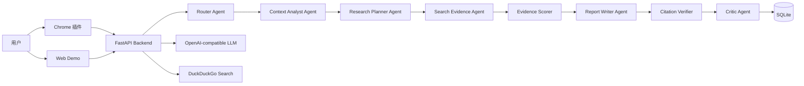

# Eureka Architecture

Eureka 采用浏览器插件、Web Demo 和本地 FastAPI 后端三层结构。



## Agent 职责

| Agent | 职责 | 输出 |
| --- | --- | --- |
| Router Agent | 判断上下文回答或深度调研 | route、reason、search queries |
| Context Analyst Agent | 清洗网页并提取摘要和关键点 | context_summary、key_points |
| Research Planner Agent | 拆解子问题并补充检索词 | sub_questions、search_queries |
| Search Evidence Agent | 搜索、去重、整理证据 | evidence_cards |
| Evidence Scorer | 判断来源类型、置信度和引文片段 | source_type、confidence、quote |
| Report Writer Agent | 生成结构化 Markdown 报告 | draft_report、final_report |
| Citation Verifier | 检查引用编号是否覆盖证据来源 | 引用校验说明 |
| Critic Agent | 审查回答完整性和引用 | critique |

## 事件流

`/api/research` 和 `/api/demo/research` 使用 NDJSON 返回事件：

```json
{"type":"trace","agent":"RouterAgent","content":"判断为 deep_research"}
{"type":"token","content":"# 调研报告"}
{"type":"done","report_id":1}
```

这种设计让前端能够同时展示 Agent 执行过程和最终报告。
