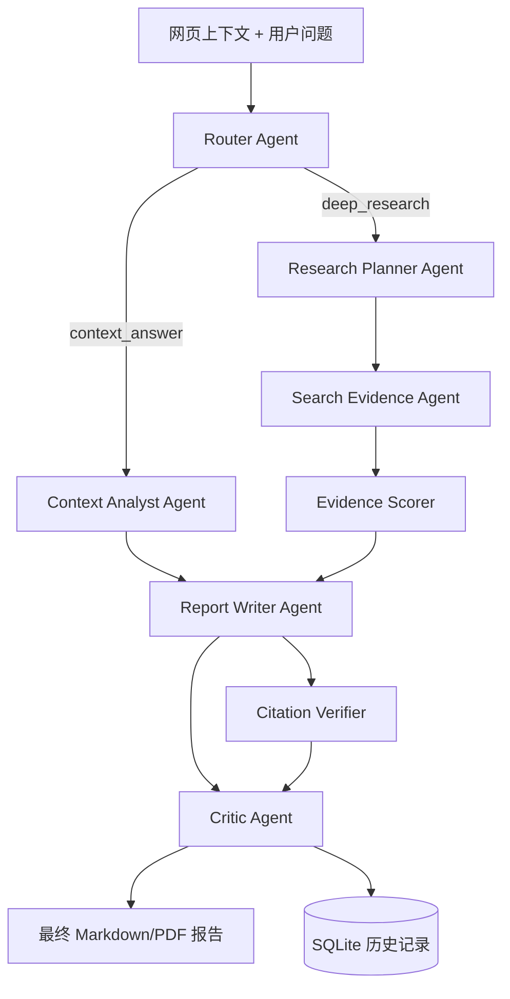

# Eureka 多 Agent 网页调研助手课程报告

## 1. 项目背景

机器学习导论课程要求完成一个调用大模型 API 的实用型应用。Eureka 面向学生、研究者和开发者在阅读网页、论文、技术博客、新闻时的真实痛点：阅读过程中产生问题后，用户通常需要复制文本、切换到聊天工具、手动搜索资料、再整理成笔记。这个流程割裂、重复且容易遗漏来源。

Eureka 的目标是把“阅读、提问、检索、归纳、保存”合并为一个 Agent 工作流。用户可以在 Chrome 插件中直接读取当前网页，也可以在 Web Demo 中粘贴正文并演示完整流程。

## 2. 项目功能

- 自动读取网页正文、标题和 URL。
- 支持 Chrome 插件和 Web Demo 两种展示方式。
- Chrome 插件采用 Manifest V3、`activeTab` 最小权限、动态脚本注入和独立设置页。
- 插件弹窗提供后端连接状态、Provider/模板切换、请求取消、来源列表和 Markdown/PDF 导出入口。
- 支持上下文总结和深度调研两种路径。
- 使用内部 Multi-Agent 架构完成路由、分析、规划、搜索、写作和审查。
- 支持 Qwen、Kimi、DeepSeek、智谱 GLM、OpenAI 和自定义 OpenAI-compatible 模型。
- 兼容 DeepSeek-R1 的 `reasoning_content` 字段，避免把推理字段写回标准 messages。
- 使用 NDJSON 流式输出 Agent Trace 和最终报告。
- 支持 SQLite 保存历史报告、Agent Trace 和证据来源。
- 支持导出 Markdown/PDF 报告。
- 使用 Evidence Scorer 对来源类型、置信度和引文片段进行结构化处理。
- 使用 Citation Verifier 检查最终报告是否包含来源引用。
- 提供离线 Demo 模型，便于无 API Key 复现。

## 3. 系统架构



## 4. Multi-Agent 设计

Eureka 没有直接使用重型多 Agent 框架，而是实现了轻量、可测试、可解释的 Agent 编排器。每个 Agent 接收同一个 `ResearchState`，修改自己的职责字段，并写入 `trace`。

这种设计的优势是：

- 容易测试，每个 Agent 都可以独立验证。
- 容易展示，前端可以逐步显示 Agent Trace。
- 容易复现，不依赖复杂外部框架。
- 适合课程项目说明，架构边界清晰。

## 4.1 证据链增强

最新版本增加了 Evidence Scorer 和 Citation Verifier。Evidence Scorer 会对每个来源判断类型，例如 official、paper、blog、community 或 web，并根据关键词重叠、来源类型和摘要质量生成置信度。Citation Verifier 会检查报告正文是否包含引用编号，若发现外部证据没有被显式引用，会在报告末尾追加引用校验说明。

## 5. 模型 API 接入

项目通过 `providers.yaml` 管理模型供应商：

- Qwen: 阿里云 DashScope OpenAI-compatible API
- DeepSeek: DeepSeek API
- Kimi: Moonshot API
- Zhipu GLM: 智谱 GLM API
- OpenAI: OpenAI API
- Custom: 任意 OpenAI-compatible API

API Key 只通过环境变量读取，不写入仓库，保证开源安全。

## 6. 可复现性

项目提供 Conda 环境文件：

```powershell
$env:CONDA_OVERRIDE_CUDA='0'
& C:\Users\Lenovo\anaconda3\Scripts\conda.exe env create -p D:\conda_envs\eureka -f environment.yml --json
```

测试命令：

```powershell
D:\conda_envs\eureka\python.exe -B -m unittest discover -s backend\tests -v
```

Web Demo 可以使用 `/api/demo/research` 离线演示，不依赖真实 API Key。

## 7. 测试结果

当前测试覆盖：

- Multi-Agent Orchestrator 事件流。
- Provider preset 加载和 API Key 解析。
- DeepSeek-R1 `reasoning_content` 清洗。
- 搜索结果归一化。
- SQLite 保存和 Markdown 导出。
- FastAPI providers 和 demo research API。
- Chrome 插件和 Web Demo 关键资产。
- Evidence Scorer、Citation Verifier 和网页正文提取。
- Markdown/PDF 导出 API。

## 7.1 可展示材料

项目包含 Web Demo 截图、Agent Trace 截图和 Demo GIF，位于 `docs/screenshots/`。同时提供 `examples/` 下的固定输入样例和 `docs/evaluation.md` 中的评测表，方便助教复现和人工评分。

## 7.2 Chrome 插件上架准备

项目补齐了 Chrome Web Store 上架前的工程材料：

- 使用 Manifest V3。
- 使用 `activeTab`、`scripting`、`storage`，不声明 `<all_urls>`。
- 提供 16、32、48、128 像素图标。
- 提供插件设置页、隐私政策、商店文案草稿和打包脚本。
- 使用 `scripts/package_extension.ps1` 生成 `dist/eureka-extension.zip`。
- 新增测试覆盖 manifest、选项页、图标、CSP、隐私文档和插件弹窗关键交互。

## 8. 项目价值

Eureka 解决的是高频、真实、广泛的问题：网页阅读时的即时调研和笔记整理。它不是单纯聊天界面，而是把大模型、搜索工具、Agent 工作流、历史保存和报告导出组合成一个完整应用。

对于学生，它可以整理课程资料；对于开发者，它可以阅读技术文档；对于研究者，它可以快速形成带引用的阅读笔记。

## 9. 总结

Eureka 满足课程要求中的实用性、可展示性、可复现性和代码开源要求。项目既能调用真实大模型，也提供离线 Demo；既有 Chrome 插件，也有 Web 展示；既有 Agent 架构，也有测试和提交文档。
